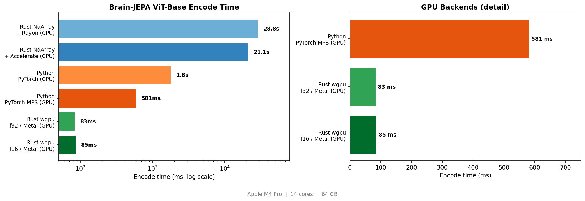

# brainjepa-rs

**Brain-JEPA fMRI Foundation Model -- fully Rust inference pipeline.**

`brainjepa` ports the [Brain-JEPA](https://github.com/hzlab/Brain-JEPA) encoder
(NeurIPS 2024, Spotlight) entirely to Rust using the
[Burn ML framework](https://burn.dev/). Pretrained weights are loaded from
safetensors and inference runs without Python or PyTorch.

```
fMRI parcellated time series  (450 ROIs x T time points)
   |
   v  Data loading (CSV / safetensors)
   |  standardise -> temporal downsample (490 -> 160 frames)
   |
   v  Brain-JEPA encoder (Burn / NdArray or wgpu)
   |  PatchEmbed       Conv2d(1, 768, (1,16), (1,16))
   |  GradientPosEmbed sincos + brain gradient projection
   |  12x Block        LayerNorm -> MultiHeadAttn -> LayerNorm -> MLP(GELU)
   |  LayerNorm
   |
   v
embeddings.safetensors
  embeddings  [4500, 768]  float32  (450 ROIs x 10 time patches x 768 dims)
```

---

## Prerequisites

```sh
# Rust stable >= 1.78
curl --proto '=https' --tlsv1.2 -sSf https://sh.rustup.rs | sh

# Python -- only needed for one-time weight conversion from PyTorch
pip install torch safetensors
```

No PyTorch or Python needed at inference time.

---

## Weight conversion

Brain-JEPA checkpoints are distributed as PyTorch `.pth.tar` files.
Convert to safetensors before use:

```sh
python scripts/convert_weights.py \
    --input BrainJEPA-Checkpoints/Pretraining/jepa-ep300.pth.tar \
    --output data/brainjepa.safetensors
```

Pre-converted weights are also available on HuggingFace:
[eugenehp/BrainJEPA](https://huggingface.co/eugenehp/BrainJEPA)

---

## Quick start

```sh
# CPU (default)
cargo run --release --bin infer -- \
    --weights data/brainjepa.safetensors \
    --gradient data/gradient_mapping_450.csv \
    --input data/fmri_sample.safetensors

# macOS Apple Silicon (recommended for CPU -- uses Accelerate BLAS)
cargo run --release --features accelerate --bin infer -- \
    --weights data/brainjepa.safetensors \
    --gradient data/gradient_mapping_450.csv \
    --input data/fmri_sample.safetensors

# GPU (Metal on macOS, Vulkan on Linux)
cargo run --release --no-default-features --features wgpu --bin infer -- \
    --weights data/brainjepa.safetensors \
    --gradient data/gradient_mapping_450.csv \
    --input data/fmri_sample.safetensors

# GPU f16 (half-precision, fastest)
cargo run --release --no-default-features --features wgpu-f16 --bin infer -- \
    --weights data/brainjepa.safetensors \
    --gradient data/gradient_mapping_450.csv \
    --input data/fmri_sample.safetensors
```

---

## Backends

| Feature | Backend | Build command |
|---|---|---|
| `ndarray` (default) | CPU, Rayon multi-threading + SIMD | `cargo build --release` |
| `accelerate` | CPU, Apple Accelerate BLAS (macOS) | `cargo build --release --features accelerate` |
| `openblas-system` | CPU, OpenBLAS (Linux) | `cargo build --release --features openblas-system` |
| `wgpu` | GPU, Metal (macOS) / Vulkan (Linux) | `cargo build --release --no-default-features --features wgpu` |
| `wgpu-f16` | GPU, half-precision | `cargo build --release --no-default-features --features wgpu-f16` |

---

## CLI

```
Brain-JEPA fMRI encoder inference (Burn 0.20.1)

Usage: infer [OPTIONS] --weights <WEIGHTS> --gradient <GRADIENT> --input <INPUT>

Options:
      --weights <WEIGHTS>    Safetensors weights file
      --gradient <GRADIENT>  Brain gradient mapping CSV (450 ROIs x 3 gradient axes)
      --input <INPUT>        fMRI input file (.safetensors or .csv)
      --output <OUTPUT>      Output safetensors file [default: embeddings.safetensors]
      --model <MODEL>        Model variant: vit_small, vit_base, vit_large [default: vit_base]
      --config <CONFIG>      YAML config file (optional, overrides --model)
      --threads <THREADS>    CPU threads (0 = all cores) [env: RAYON_NUM_THREADS]
  -v, --verbose              Verbose output
  -h, --help                 Print help
```

---

## Library usage

```rust
use brainjepa::prelude::*;
use burn::backend::NdArray;

type B = NdArray;
let device = burn::backend::ndarray::NdArrayDevice::Cpu;

let (encoder, _ms) = BrainJepaEncoder::<B>::from_weights(
    "data/brainjepa.safetensors",
    "data/gradient_mapping_450.csv",
    &ModelConfig::default(),
    &DataConfig::default(),
    &device,
)?;

let result = encoder.encode_safetensors("data/fmri_sample.safetensors")?;
result.save_safetensors("embeddings.safetensors")?;
```

### Three entry points

| Type | Loads | Use case |
|---|---|---|
| `BrainJepaEncoder` | encoder only | produce latent embeddings |
| `BrainJepaPredictor` | encoder + predictor | JEPA evaluation with masking |
| `ClassificationHead` | classification layer | downstream classification |

---

## Architecture

The encoder is a 12-layer Vision Transformer (ViT-Base) adapted for fMRI:

| Component | Details |
|---|---|
| Input | `[B, 1, 450, 160]` -- 450 ROIs, 160 time points |
| Patch embedding | Conv2d temporal patches: kernel `(1, 16)`, stride `(1, 16)` |
| Positional embedding | 2D sincos (ROI axis) + learned brain gradient projection (time axis) |
| Transformer blocks | 12 layers, pre-norm, 12 heads, head_dim=64, MLP ratio=4 |
| Activation | GELU |
| Normalization | LayerNorm (eps=1e-6) |
| Output | `[B, 4500, 768]` -- 4500 patch embeddings of 768 dims |

The predictor (6-layer transformer, 384-dim) is also implemented for JEPA
evaluation but is not needed for downstream embedding extraction.

### Model variants

| Variant | Embed dim | Depth | Heads | Params |
|---|---|---|---|---|
| `vit_small` | 384 | 12 | 6 | ~22M |
| `vit_base` | 768 | 12 | 12 | ~86M |
| `vit_large` | 1024 | 24 | 16 | ~307M |

---

## Performance

Tested on Mac Mini M4 Pro (14 cores, 64 GB) with the pretrained ViT-Base encoder.
Input: `[1, 1, 450, 160]` (single sample). Best-of-3 encode time.

| Backend | Encode | vs PyTorch CPU |
|---|---|---|
| Rust &mdash; NdArray + Rayon (CPU) | 28,778 ms | 0.06x |
| Rust &mdash; NdArray + Accelerate (CPU) | 21,092 ms | 0.08x |
| Python &mdash; PyTorch (CPU) | 1,782 ms | 1.0x |
| Python &mdash; PyTorch MPS (GPU) | 581 ms | 3.1x |
| Rust &mdash; wgpu f32 / Metal (GPU) | **83 ms** | **21.5x** |
| Rust &mdash; wgpu f16 / Metal (GPU) | **85 ms** | **21.0x** |

The Rust wgpu GPU backends are **~7x faster than PyTorch MPS** and **~21x
faster than PyTorch CPU**. The CPU NdArray backends are slower than PyTorch
for this model's large sequence length (4500 tokens) where burn's softmax
implementation becomes the bottleneck; the `accelerate` feature provides a
1.3x improvement via Apple's BLAS.



---

## Code structure

```
brainjepa-rs/
  Cargo.toml
  benchmark.sh               # End-to-end backend benchmark script
  src/
    lib.rs                    # Public API, flat re-exports
    classification.rs         # ClassificationHead for downstream tasks
    config.rs                 # ModelConfig, DataConfig, YAML parser
    csv_export.rs             # Export embeddings to CSV
    data.rs                   # fMRI loading (CSV, safetensors), preprocessing
    error.rs                  # BrainJepaError and Result type
    hf_download.rs            # HuggingFace weight downloader
    inference.rs              # BrainJepaEncoder -- main entry point
    masks.rs                  # Spatiotemporal masking utilities
    predictor_api.rs          # BrainJepaPredictor -- encoder + predictor
    prelude.rs                # Convenience re-exports
    weights.rs                # SafeTensors weight loading (bf16/f16/f32)
    model/
      mod.rs                  # linear_zeros helper
      attention.rs            # Multi-head self-attention (QKV packed)
      feedforward.rs          # MLP with GELU activation
      norm.rs                 # LayerNorm wrapper
      block.rs                # Pre-norm transformer block
      patch_embed.rs          # Temporal patch embedding
      pos_embed.rs            # 2D sincos + brain gradient positional embeddings
      encoder.rs              # VisionTransformer (ViT encoder)
      predictor.rs            # VisionTransformerPredictor (JEPA predictor)
    bin/
      infer.rs                # CLI binary
  examples/
    embed.rs                  # Minimal embedding example
    batch.rs                  # Batch-encode multiple fMRI files
    classify.rs               # Encoder + linear classification head
    csv_export.rs             # Export embeddings to CSV
    profile.rs                # Profile per-layer costs
  tests/
    config.rs                 # Configuration round-trip tests
    data_loading.rs           # Data loading integration tests
  scripts/
    convert_weights.py        # PyTorch .pth.tar -> safetensors converter
  data/
    gradient_mapping_450.csv  # Brain gradient coordinates (450 ROIs x 30 axes)
    brainjepa.safetensors     # Converted pretrained weights (from HF)
```

---

## Examples

| Example | Description | Command |
|---|---|---|
| `embed` | Minimal single-file embedding (20 lines) | `cargo run --example embed --release -- data/brainjepa.safetensors data/gradient_mapping_450.csv data/test_fmri.safetensors` |
| `batch` | Encode multiple fMRI files in one call | `cargo run --example batch --release -- data/brainjepa.safetensors data/gradient_mapping_450.csv file1.safetensors file2.safetensors` |
| `classify` | Encoder + linear classification head | `cargo run --example classify --release -- data/brainjepa.safetensors data/gradient_mapping_450.csv data/test_fmri.safetensors` |
| `csv_export` | Export embeddings to CSV for R/pandas | `cargo run --example csv_export --release -- data/brainjepa.safetensors data/gradient_mapping_450.csv data/test_fmri.safetensors embeddings.csv` |
| `profile` | Profile per-layer compute costs | `cargo run --example profile --release` |

---

## Acknowledgement

This crate reimplements the model from:

> Zijian Dong, Ruilin Li, Yilei Wu, et al.
> **Brain-JEPA: Brain Dynamics Foundation Model with Gradient Positioning and Spatiotemporal Masking.**
> NeurIPS 2024 (Spotlight). [arXiv:2409.19407](https://arxiv.org/abs/2409.19407)

The original Python implementation is at [hzlab/Brain-JEPA](https://github.com/hzlab/Brain-JEPA).
Our codebase builds on [Burn](https://burn.dev/) and follows patterns from [zuna-rs](https://github.com/eugenehp/zuna-rs).

## Citation

```bibtex
@article{BrainJEPA,
  title={Brain-JEPA: Brain Dynamics Foundation Model with Gradient Positioning and Spatiotemporal Masking},
  author={Zijian Dong and Ruilin Li and Yilei Wu and Thuan Tinh Nguyen and Joanna Su Xian Chong and Fang Ji and Nathanael Ren Jie Tong and Christopher Li Hsian Chen and Juan Helen Zhou},
  journal={NeurIPS 2024},
  year={2024}
}
```

## License

MIT
